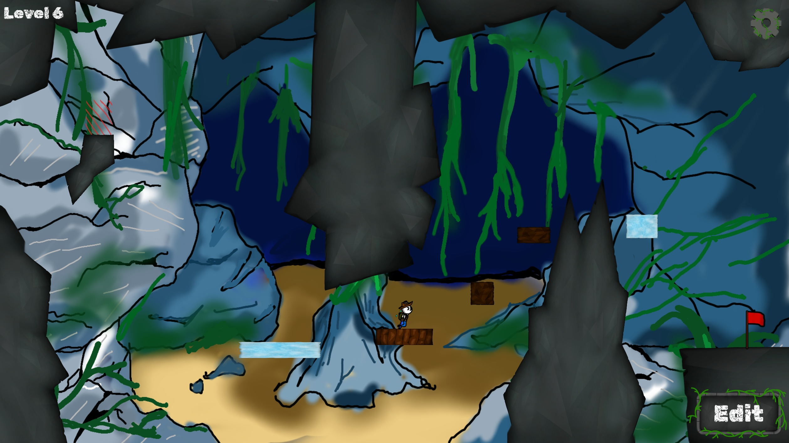
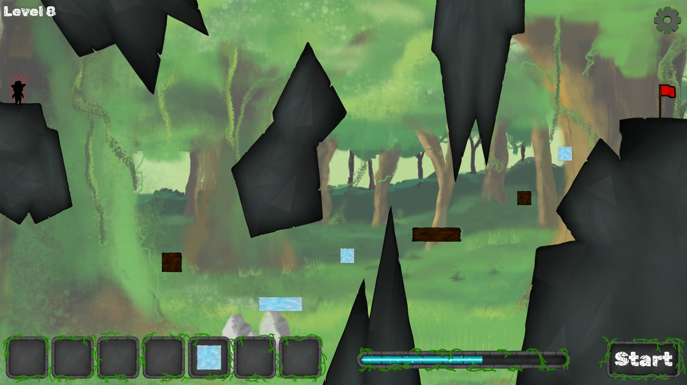
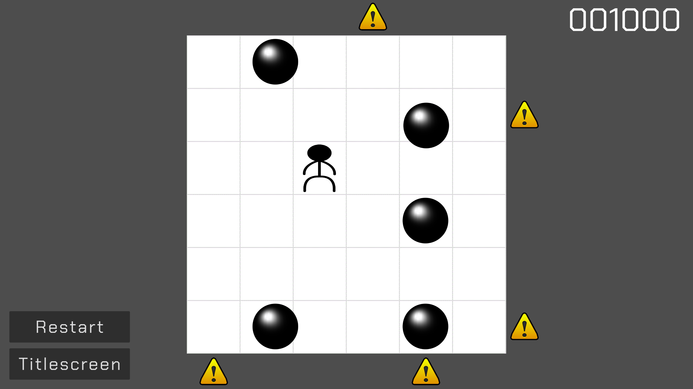
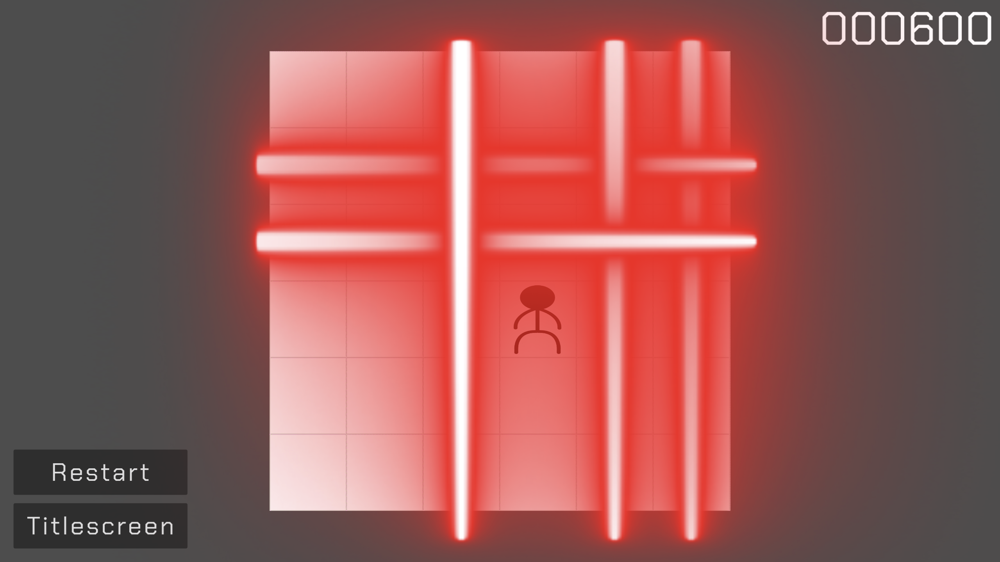
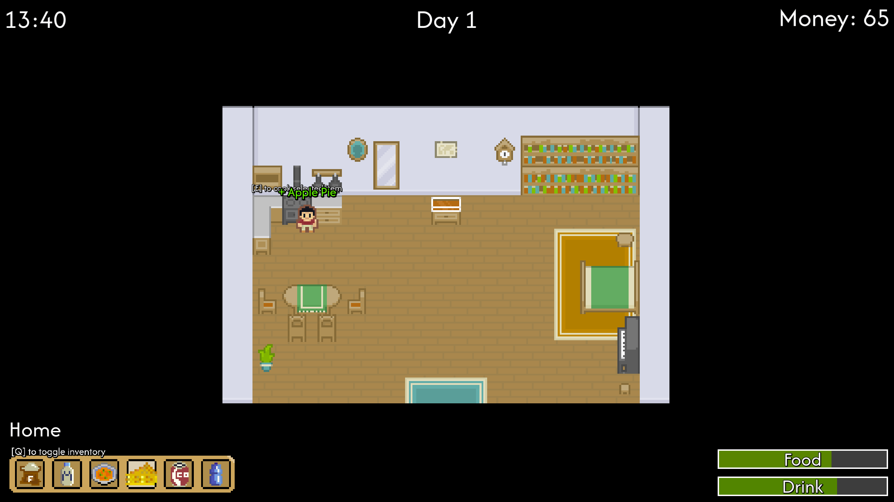
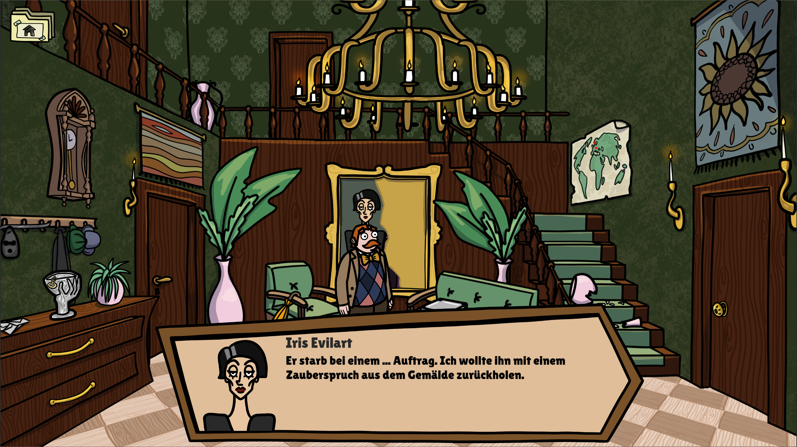
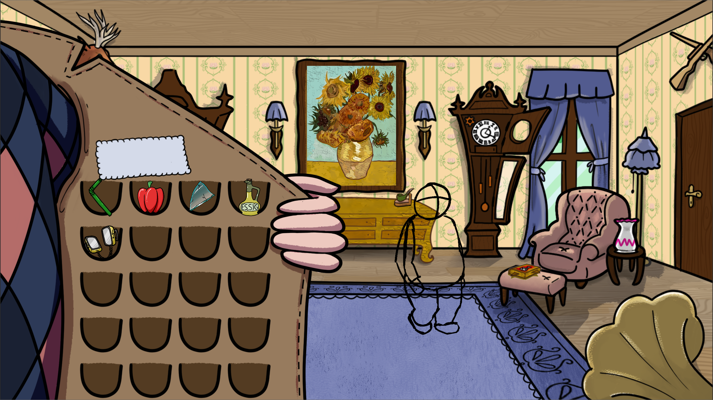

# Portfolio

Willkommen auf meinem Portfolio! Ich bin **Medienstudent** mit Fokus auf **Game Development**. Hier zeige ich meine Projekte, Erfahrungen und Fähigkeiten in der Spieleentwicklung.

---

## Über mich

Ich bin **Tak Kin Cheung**, ein leidenschaftlicher Spieleentwickler mit Erfahrung in der Programmierung in Java, Python und GDScript. Derzeit studiere ich **Audiovisuelle Medien** im 4. Semester an der **Hochschule der Medien Stuttgart**, wo ich mich im Bereich **Interaktive Medien** spezialisiere.

**Schwerpunkte:**
- **Programmiersprachen:** Java, Python, GDScript  
- **Game Engines:** Godot Engine  
- **Tools:** Git, Trello  

---

## Meine Projekte

### 1. **Jonny Jumper (2024)**
[Link zu itch.io](https://fetzen.itch.io/jonny-jumper)

Ein in der GMTK Game Jam 2024 entstandenes Puzzle Jump 'n' Run, das ich mit Kommilitonen innerhalb von 4 Tagen entwickelt habe. Ich war hauptsächlich zuständig für die Programmierung und Implementation.

**Engine:** Godot 4.3  
**USP:** Skalierbare Blöcke, die man selbst platziert, um das Level zu schaffen  

  
  

---

### 2. **Flux (2024)**
[Link zu itch.io](https://daruma4.itch.io/flux) (Passwort: 1234)

Ein eigenständiges Projekt von mir, das Spielkonzept von *Mr.Oops!* von PONOS nachzuprogrammieren, wo man Kanonenkugeln und Lasern ausweichen muss.

**Engine:** Godot 4.3  
**USP:** Endlosmodus mit programmierten Patterns  

  
  

---

### 3. **Nett hier. But have you ever played a Swabian Simulation? (2025)**
[Link zu itch.io](https://daruma4.itch.io/nett-hier) (Passwort: 1234)

Eine Gruppenabgabe im Rahmen der Hochschule. Es handelt sich um eine Lebenssimulation mit dem Ziel, so viel Geld wie möglich am Ende angespart zu haben. Hier war ich für das Game Design, Programmierung und Sound zuständig.

**Engine:** Godot 4.3  
**USP:** Viele Interaktionsmöglichkeiten auf einer großen Overworld  

  
  

---

### 4. **[ongoing] Curse of Lady Evilart (2025)**

Studioproduktion in meinem 4. Semester. Ein Point-And-Click Puzzle Game mit Fokus auf das Zusammenspiel unterschiedlicher Artstyles innerhalb eines Spiels.

**Engine:** Godot 4.4  
**USP:** Verschmelzung unterschiedlicher Artstyles  

  
  

---

## Kontakt

- **E-Mail:** cheungtkn@gmail.com  

---

**Ich freue mich auf jede Gelegenheit, mit anderen kreativen Entwicklern und Game Studios zusammenzuarbeiten!**
